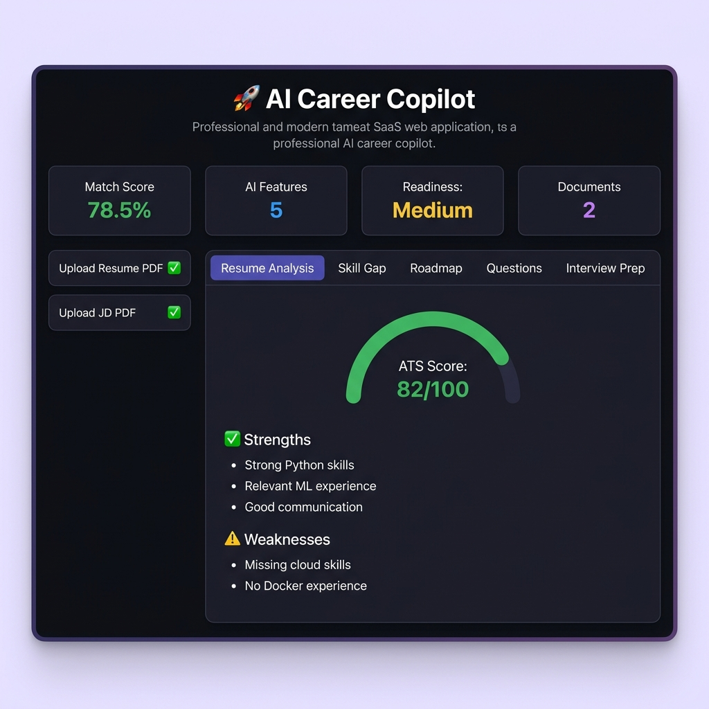
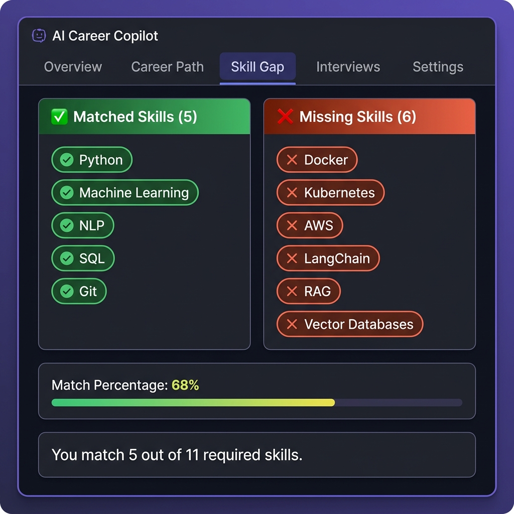
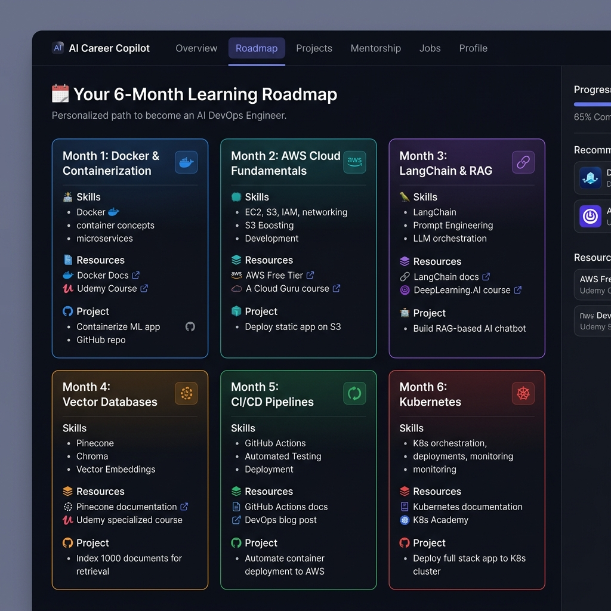
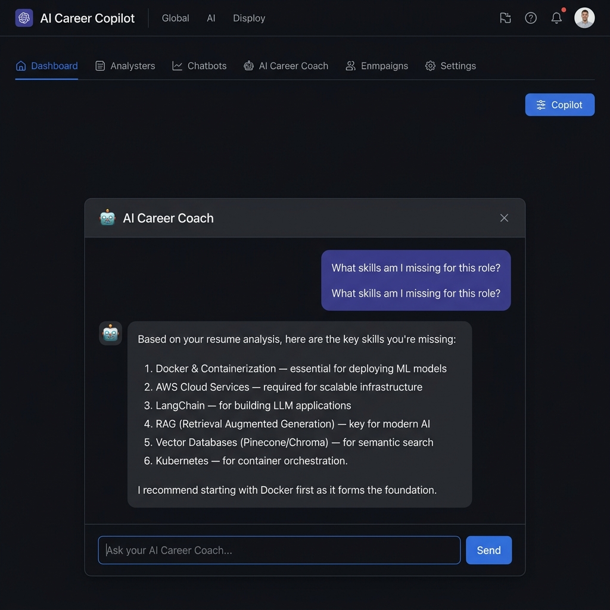
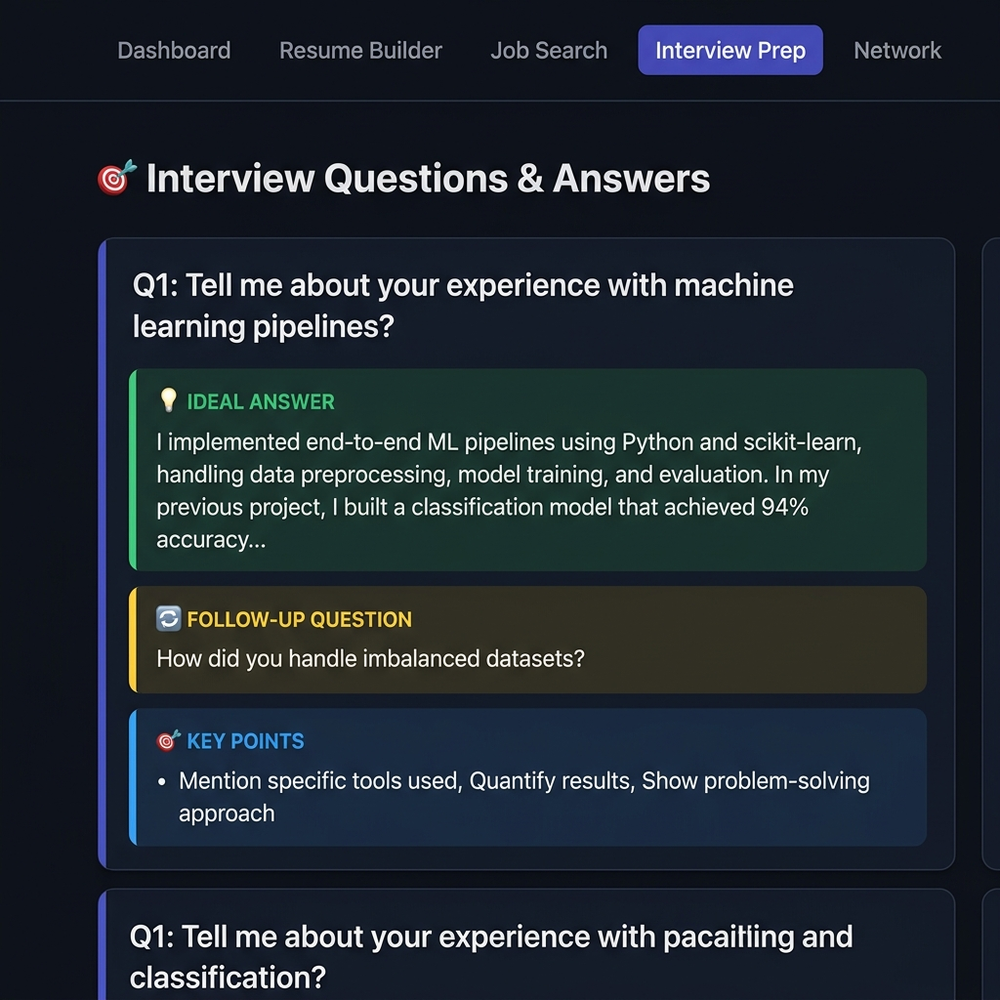
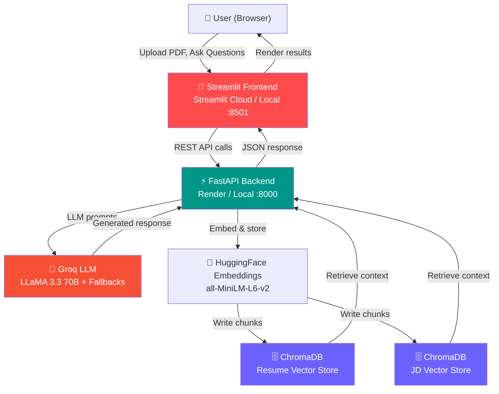

<div align="center">

# 🚀 AI Career Copilot

**Intelligent Resume Analyzer & Career Assistant powered by RAG, LangChain, and Groq LLMs**

[](https://python.org)
[](https://fastapi.tiangolo.com)
[](https://streamlit.io)
[](https://langchain.com)
[](https://trychroma.com)
[](https://groq.com)
[](https://docker.com)
[](LICENSE)

[**Live Demo**](https://your-app.streamlit.app) · [**API Docs**](https://your-app.onrender.com/docs) · [**Report Bug**](https://github.com/DhanushReddyN/AI_Career_Copilot/issues)

</div>

---

## 📸 Screenshots

### Career Readiness Dashboard


### Skill Gap Analysis


### 6-Month Learning Roadmap


### AI Career Coach Chatbot


### Interview Preparation Kit


---

## ✨ Features

| Feature | Description |
|---|---|
| 📄 **Resume Analysis** | ATS scoring, strengths, weaknesses, and improvement recommendations |
| 🎯 **Skill Gap Detection** | Side-by-side comparison of resume skills vs. job description requirements |
| 🛣️ **6-Month Roadmap** | Personalised learning plan with resources and projects for missing skills |
| ❓ **Interview Questions** | 30 personalised questions across 6 sections based on your actual resume |
| 🎤 **Interview Prep Kit** | 10 Q&As with full model answers written in first person |
| 🤖 **AI Career Coach** | Conversational agent that calls tools dynamically based on your question |
| 📊 **Match Score** | Cosine similarity score between resume and job description embeddings |

---

## 🏗️ Architecture



---

## 🛠️ Tech Stack

| Layer | Technology |
|---|---|
| **Frontend** | Streamlit 1.45 |
| **Backend** | FastAPI 0.115 + Uvicorn |
| **LLM** | Groq API — LLaMA 3.3 70B (with auto-fallback to 8B / Gemma2 / Mixtral) |
| **Embeddings** | `sentence-transformers/all-MiniLM-L6-v2` via HuggingFace |
| **Vector DB** | ChromaDB (persistent, collection-level reset on each upload) |
| **RAG** | LangChain 0.3 + LangChain-Chroma |
| **PDF Parsing** | LangChain PyPDFLoader |
| **Deployment** | Render (backend) + Streamlit Cloud (frontend) + Docker Compose (local) |

---

## 🚀 Quick Start

### Prerequisites
- Python 3.11+
- [Groq API Key](https://console.groq.com/keys) (free)
- Git

### 1. Clone & Setup

```bash
git clone https://github.com/DhanushReddyN/AI_Career_Copilot.git
cd AI_Career_Copilot

# Create and activate virtual environment
python -m venv myenv
myenv\Scripts\activate        # Windows
# source myenv/bin/activate   # Mac/Linux

# Install backend dependencies
pip install -r requirements.txt

# Install frontend dependencies
pip install -r frontend/requirements.txt
```

### 2. Configure Environment

```bash
# Copy the template
cp .env.example .env

# Edit .env and add your Groq API key
# GROQ_API_KEY=gsk_your_key_here
```

### 3. Run Locally

Open **two terminals**:

```bash
# Terminal 1 — Backend
uvicorn app.main:app --reload
# → http://127.0.0.1:8000
# → API docs: http://127.0.0.1:8000/docs

# Terminal 2 — Frontend
streamlit run frontend/streamlit_app.py
# → http://localhost:8501
```

---

## 🐳 Docker

### Run with Docker Compose (recommended)

```bash
# Copy and fill in your .env
cp .env.example .env
# Edit .env → add GROQ_API_KEY

# Build and start both services
docker compose up --build

# Backend  → http://localhost:8000
# Frontend → http://localhost:8501
```

### Docker Compose Services

| Service | Port | Description |
|---|---|---|
| `backend` | 8000 | FastAPI + ChromaDB + LLM services |
| `frontend` | 8501 | Streamlit UI |

### Useful Docker Commands

```bash
# View logs
docker compose logs -f backend
docker compose logs -f frontend

# Stop all services
docker compose down

# Stop and remove volumes (clears ChromaDB data)
docker compose down -v

# Rebuild after code changes
docker compose up --build
```

---

## ☁️ Deployment

### Backend → Render (Free)

1. **Create a Render account** at [render.com](https://render.com)
2. Click **New → Web Service** → Connect your GitHub repo
3. Select **Docker** as the runtime
4. Set these environment variables in the Render dashboard:
   ```
   GROQ_API_KEY = your_groq_api_key_here
   ```
5. Click **Deploy** — Render auto-deploys on every `git push`

> **Note:** The free Render tier spins down after 15 minutes of inactivity. First request after spin-down takes ~30s.

### Frontend → Streamlit Cloud (Free)

1. Go to [share.streamlit.io](https://share.streamlit.io)
2. Connect your GitHub account → Select this repo
3. Set **Main file path**: `frontend/streamlit_app.py`
4. Add this secret in **App Settings → Secrets**:
   ```toml
   FASTAPI_URL = "https://your-app-name.onrender.com"
   ```
5. Click **Deploy** 🚀

---

## 📁 Project Structure

```
AI_Career_Copilot/
├── 📂 app/                          # FastAPI Backend
│   ├── main.py                      # App entry point, CORS, health check
│   ├── 📂 routes/
│   │   ├── resume.py                # Upload, analyze, skill-gap, roadmap, interview endpoints
│   │   ├── jd.py                    # Job description upload endpoint
│   │   └── agent.py                 # Career coach chat endpoint
│   ├── 📂 services/
│   │   ├── llm_service.py           # Groq LLM with rate-limit fallback
│   │   ├── vector_store.py          # ChromaDB with fresh-collection-on-upload fix
│   │   ├── career_agent_v2.py       # LangChain tool-calling agent
│   │   ├── resume_analyzer.py       # ATS scoring & analysis
│   │   ├── skill_gap_service.py     # Resume vs JD comparison
│   │   ├── roadmap_service.py       # 6-month learning roadmap
│   │   ├── interview_service.py     # Interview question generation
│   │   ├── interview_prep_service.py # Full interview prep with answers
│   │   ├── match_service.py         # Cosine similarity match score
│   │   └── ...                      # Supporting services
│   └── 📂 data/
│       ├── resumes/                 # Uploaded resume PDFs (gitignored)
│       └── jds/                     # Uploaded JD PDFs (gitignored)
│
├── 📂 frontend/                     # Streamlit Frontend
│   ├── streamlit_app.py             # Main Streamlit application
│   ├── requirements.txt             # Frontend-only dependencies
│   └── Dockerfile                   # Frontend Docker image
│
├── 📂 docs/screenshots/             # README screenshots
├── 📂 .streamlit/
│   └── config.toml                  # Streamlit theme (dark mode, purple accent)
│
├── Dockerfile                       # Backend Docker image
├── docker-compose.yml               # Local development orchestration
├── render.yaml                      # Render deployment blueprint
├── requirements.txt                 # Backend dependencies
├── .env.example                     # Environment variable template
├── .gitignore                       # Excludes secrets, venvs, vector stores
└── README.md
```

---

## 🔑 Environment Variables

| Variable | Required | Description | Default |
|---|---|---|---|
| `GROQ_API_KEY` | ✅ Yes | Groq API key for LLM inference | — |
| `FASTAPI_URL` | Frontend only | URL of the FastAPI backend | `http://127.0.0.1:8000` |

---

## 🧠 How It Works

### Upload Flow
```
PDF Upload → PyPDFLoader → Text Chunks → HuggingFace Embeddings
→ ChromaDB Collection (fresh, old collection deleted) → Ready for RAG
```

### Analysis Flow
```
User clicks "Analyze" → FastAPI endpoint → get_documents() from ChromaDB
→ LLM prompt with full resume context → Groq API → Structured response
```

### Rate Limit Handling
The `RateLimitAwareLLM` wrapper automatically falls back through models:
```
llama-3.3-70b-versatile  →  llama-3.1-8b-instant  →  gemma2-9b-it  →  mixtral-8x7b-32768
```

### Agent (Career Coach Chat)
```
User message → LangChain tool-calling LLM → Selects tool
→ Executes (resume_analysis / skill_gap / roadmap / interview) → Returns result
```

---

## 🤝 Contributing

1. Fork the repository
2. Create a feature branch: `git checkout -b feature/amazing-feature`
3. Commit your changes: `git commit -m 'Add amazing feature'`
4. Push to the branch: `git push origin feature/amazing-feature`
5. Open a Pull Request

---

## 📄 License

This project is licensed under the MIT License — see the [LICENSE](LICENSE) file for details.

---

## 👨‍💻 Author

**Dhanush Reddy N**  
[](https://github.com/DhanushReddyN)

---

<div align="center">
  <p>⭐ Star this repo if you found it helpful!</p>
  <p>Built with ❤️ using LangChain, FastAPI, Streamlit & Groq</p>
</div>
